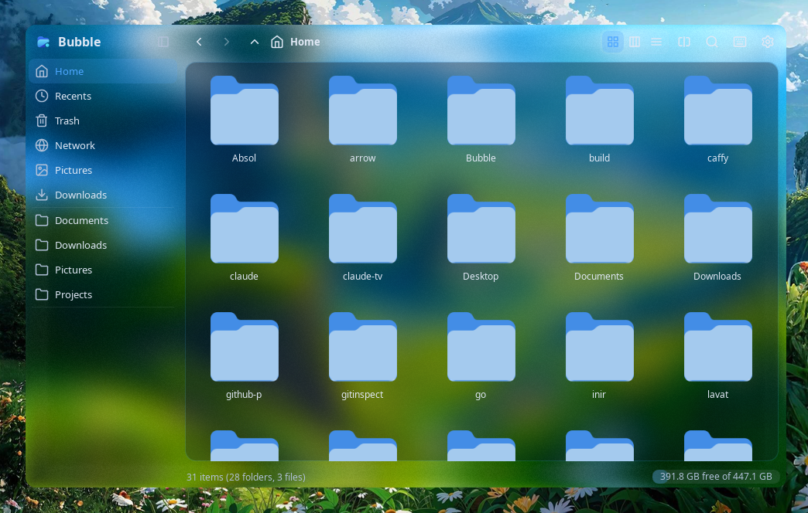

<div align="center">


**A fast, modern Wayland file manager with Miller columns and a built-in Secure Vault.**

[](https://github.com/TattvaOrg/Bubble/releases)
[](https://github.com/TattvaOrg/Bubble/actions)
[](https://github.com/TattvaOrg/Bubble/releases)
[](http://makeapullrequest.com)
[](https://wayland.freedesktop.org/)
[](https://www.kernel.org/)

[Installation](#-installation) •
[Uninstallation](#4-uninstallation) •
[Secure Vault](#-secure-file--folder-vault) •
[Features](#-core-features) •
[Shortcuts](#-keyboard-shortcuts) •
[Theming](#-theming--customization) •
[Compositor & Glass](#-compositor-integration-hyprland-niri--lniri)




---

</div>

Bubble is a lightweight, responsive Qt6/QML desktop file manager engineered natively for Wayland and Hyprland. Combining **macOS Finder-style Miller columns**, buttery-smooth kinetic scrolling, and **AES-256 encrypted file vaults**, Bubble offers the speed of a keyboard-driven workflow with the polish of a modern desktop utility.

---


## Installation

### 1. Interactive One-Liner Install

Run the official installer and pick your preferred method (1 or 2):

```bash
curl -fsSL https://raw.githubusercontent.com/TattvaOrg/Bubble/main/install.sh | bash
```

### 2. Direct One-Liners

Choose directly between prebuilt AppImage or compiling from source:

#### Option 1: Prebuilt AppImage (Recommended)
Downloads the prebuilt binary, installs `bubble` to `~/.local/bin`, and configures desktop integration without needing build tools:
```bash
curl -fsSL https://raw.githubusercontent.com/TattvaOrg/Bubble/main/install.sh | bash -s -- 1
```

#### Option 2: Compile from Source
Fetches the source code, resolves dependencies, and builds natively with CMake & Ninja:
```bash
curl -fsSL https://raw.githubusercontent.com/TattvaOrg/Bubble/main/install.sh | bash -s -- 2
```

**Additional Installer Flags:**
- `1` / `--binary` / `--appimage` : Prebuilt binary *(default)*
- `2` / `--source` / `--build`    : Compile from source
- `--system`                      : Install system-wide to `/usr/local` *(requires sudo)*
- `--prefix <dir>`                : Install to a custom directory path
- `--tag <tag>`                   : Install a specific version tag *(e.g. `continuous`, `v0.6.1`)*
- `-y` / `--yes`                  : Automatically accept dependency installs without prompting


### 3. Complete Uninstallation & Wipeout

To completely wipe out Bubble, including all binaries, desktop integrations, configuration, cache, and cryptographically shred all locked vault files:

```bash
# One-liner remote uninstaller
curl -fsSL https://raw.githubusercontent.com/TattvaOrg/Bubble/main/uninstall.sh | bash

# Or run locally from cloned repository
./uninstall.sh
```

> [!WARNING]
> The uninstaller prompts once for confirmation (`Are you sure you want to completely wipe Bubble and all locked files? [y/N]`) and wipes everything clean. Pass `-y` to run non-interactively.

---

## Secure File & Folder Vault

Bubble includes a built-in cryptographic vault that lets you lock sensitive files and directories directly from the file manager with zero complex setup.
*Lock files instantly from context menus or with a single keyboard shortcut*

</div>

### Key Capabilities

- **One-Key Lock/Unlock (`Ctrl+Shift+L`)**: Select any file or folder and press `Ctrl+Shift+L` (or right-click → **Lock/Unlock**) to secure it with a password.
- **Authenticated Encryption**: Backed by **AES-256-GCM** authenticated encryption with **Argon2id** key derivation to prevent brute-force attacks.
- **Root & Tamper Prevention**: Locked items are placed in strict permission lockdown (`0000`) and protected by Linux kernel immutable flags (`+i`), preventing deletion, renaming, or modification even under `sudo`.
- **Intelligent Auto-Relocking**: When you unlock a file to view or edit it, Bubble monitors the active editing session in the background and automatically re-encrypts and locks it when you're finished.
- **Visual Status Indicators**: Locked files display a secure badge in both detailed and grid views.
- **Ghost-Lock & Corruption Protection**: Automatic integrity checks verify HMAC/GCM tags before decryption to guard against corruption or tampered data.

---

## Core Features

### Dynamic Views & Previews
- **Miller Columns (`Ctrl+2`)**: Seamless hierarchical navigation through directory trees with an automatic live preview pane.
- **Grid View (`Ctrl+1`)**: Responsive icon grid with adjustable column counts and kinetic mouse wheel zoom (`Ctrl+Scroll`).
- **Detailed List View (`Ctrl+3`)**: Sortable columns (Name, Size, Modified, Type, Permissions, Git status).
- **Quick Preview (`Space`)**: Instant full-screen modal preview for high-resolution images, video posters, PDFs, and syntax-highlighted code.
- **Dual-Pane Split (`F3`)**: Side-by-side independent navigation panes for rapid drag & drop and cross-folder management.

### Desktop & Wayland Integration
- **Compositor Blur**: Native Wayland surface transparency and background blur support on Hyprland and KDE Plasma.
- **Removable Media**: One-click mount and unmount of USB drives and partitions via UDisks2 and DBus.
- **Async File Transfers**: Non-blocking background copy, move, and trash operations with real-time transfer speed and ETA.
- **Git Badges**: Instant status indicators on modified, staged, and untracked files within repositories.

---

## Keyboard Shortcuts

Bubble is designed for efficient keyboard-first navigation:

### Navigation & Views
| Shortcut | Action |
|---|---|
| `Enter` / Double Click | Open file or directory |
| `Backspace` / `Alt+Up` | Go to parent directory |
| `Alt+Left` / `Alt+Right` | History Back / Forward |
| `Ctrl+L` | Focus address / path bar (inline edit) |
| `Ctrl+F` | Instant search filter |
| `Ctrl+1` / `Ctrl+2` / `Ctrl+3` | Switch to Grid / Miller Columns / Detailed View |
| `Space` | Quick Preview overlay (Images, Video, Code, PDF) |
| `F3` | Toggle Dual-Pane Split view |
| `F9` | Toggle Sidebar |
| `Ctrl+H` | Toggle hidden files (`.dotfiles`) |
| `Ctrl+Shift+B` | Toggle background transparency / blur |

### Tabs & Windows
| Shortcut | Action |
|---|---|
| `Ctrl+T` | Open new tab |
| `Ctrl+W` | Close current tab |
| `Ctrl+Shift+T` | Reopen last closed tab |
| `Ctrl+Tab` / `Ctrl+Shift+Tab` | Cycle next / previous tab |
| `Alt+1` – `Alt+9` | Jump directly to tab 1–9 |
| `Ctrl+Alt+N` | Open new independent window |

### File Operations & Security
| Shortcut | Action |
|---|---|
| `Ctrl+Shift+L` | **Lock / Unlock file or folder in Vault** |
| `F2` | Inline file rename |
| `Ctrl+C` / `Ctrl+X` / `Ctrl+V` | Copy / Cut / Paste |
| `Delete` | Send to Trash |
| `Shift+Delete` | Permanently delete |
| `Ctrl+Shift+N` | Create new directory |
| `Ctrl+N` | Create new empty file |
| `Ctrl+Alt+T` | Open terminal at current directory |

---

## Theming & Customization

Bubble features a modular TOML-based theme engine with hot-reloading on save.

```
~/.config/bubble/
├── config.toml           # User preferences and keybindings
└── themes/               # Custom user themes (*.toml)
```

### Bundled Themes
- **Catppuccin**: Mocha (dark) & Latte (light)
- **Rose Pine**: Main (dark), Moon (dim), & Dawn (light)

### Custom Colors
Create your own theme file in `~/.config/bubble/themes/my-theme.toml`:

```toml
[colors]
base    = "#1e1e2e"
mantle  = "#181825"
surface = "#313244"
text    = "#cdd6f4"
accent  = "#89b4fa"
success = "#a6e3a1"
warning = "#f9e2af"
error   = "#f38ba8"
```

Switch themes inside the app via **Settings (`Ctrl+,`)** or set `theme = "my-theme"` in `~/.config/bubble/config.toml`. Changes apply immediately without restarting.

---

## Compositor Integration (Lniri)

Bubble features native support for Wayland compositor background effects including blur, contrast, and **Lniri's fluidmorphism / liquid-glass shaders** across the entire file manager window (sidebar, navigation toolbar, tabs, and file views).

### Lniri (Liquid Glass & Fluidmorphism)

To enable liquid glass in Lniri, add this window rule to `~/.config/niri/config.kdl`:

```kdl
window-rule {
    match app-id="io.github.tattvaorg.Bubble"
    match app-id="io.github.soyeb_jim285.Bubble"
    match app-id="bubble"
    match app-id="Bubble"

    open-floating true
    default-column-width { proportion 0.72; }
    default-window-height { proportion 0.78; }

    draw-border-with-background false
    geometry-corner-radius 14
    clip-to-geometry true

    background-effect {
        blur true
        xray true
        liquid-glass {
            mode "kwin-glass"
            liquidity 0.6
            refraction-strength 4.5
            power-factor 3.2
            refraction-bevel-intensity 10.0
            refraction-offset-strength 8.0
            edge-thickness 0.18
            fringing 0.45
            glow-weight 0.015
            edge-lighting 0.20
            oklab-saturation 1.0
            saturation 1.20
            vibrancy 0.45
            adaptive-dim 0.0
            adaptive-boost 0.20
            physical-refraction 1.0
            lens-distortion 0.20
        }
    }
}
```

> [!TIP]
> - Both `match app-id="Bubble"` and `match app-id="io.github.tattvaorg.Bubble"` (as well as legacy `io.github.soyeb_jim285.Bubble`) match automatically. If your environment requires a specific custom Wayland `app-id`, specify `BUBBLE_APP_ID=<your-id> bubble`.
> - Transparency level and container transparency can be toggled and finely adjusted inside Bubble in **Settings (`Ctrl+,`)** under **Appearance**.

---

## Architecture

Bubble is architected into three distinct layers:

1. **Frontend (QML / QtQuick)**: Modern declarative UI with custom Lucide SVG vector iconography and fluid animations.
2. **Backend (C++20 & Qt6)**: High-performance `QAbstractItemModel` engines, multithreaded directory watchers, and background worker threads.
3. **Core Services**:
   - `CryptoEngine` & `VaultService`: AES-256-GCM authenticated encryption and session auto-locking.
   - `GioTransferWorker`: Asynchronous non-blocking file streaming via GIO.
   - `ThumbnailProvider`: Off-thread caching thumbnail generators for media and documents.

```mermaid
flowchart TD

subgraph group_ui["QML UI"]
  node_startup{{"Native startup &amp; registration<br/>Qt C++ entrypoint<br/>[main.cpp]"}}
  node_shell["Application shell<br/>QML window coordinator<br/>[Main.qml]"]
  node_file_views["File presentation modes<br/>QML view selector"]
end

subgraph group_models["State Models"]
  node_file_state["Filesystem &amp; tab state<br/>QAbstractItemModels"]
  node_sidebar_models["Sidebar sources<br/>QAbstractItemModels<br/>[bookmarkmodel.cpp]"]
  node_search_models["Search result models<br/>QAbstractItemModels"]
end

subgraph group_operations["File Operations"]
  node_file_operations["File operations<br/>[fileoperations.cpp]"]
  node_transfer_worker["Async GIO transfers<br/>worker"]
  node_clipboard_undo_trash["Clipboard, undo &amp; trash<br/>operation services"]
end

subgraph group_enrichment["Content &amp; Search"]
  node_preview_service["Preview orchestration<br/>[previewservice.cpp]"]
  node_preview_providers["Thumbnail &amp; PDF providers<br/>content providers"]
  node_metadata_git["Metadata &amp; Git status<br/>enrichment services"]
  node_search_service["Search execution<br/>[searchservice.cpp]"]
end

subgraph group_platform["Platform &amp; Security"]
  node_vault_pipeline["Vault encryption pipeline<br/>security services<br/>[vaultservice.cpp]"]
  node_vault_storage[("Vault persistence &amp; helpers<br/>database and executables<br/>[vaultdatabase.cpp]")]
  node_external_access["Devices &amp; remote mounts<br/>platform integration<br/>[devicemodel.cpp]"]
  node_app_state["Preferences, session &amp; theme<br/>application services<br/>[configmanager.cpp]"]
end

subgraph group_build["Build &amp; Distribution"]
  node_cmake["CMake build topology<br/>[CMakeLists.txt]"]
  node_src_cmake["Application build<br/>CMake target<br/>[CMakeLists.txt]"]
end

node_cmake -->|"includes"| node_src_cmake
node_src_cmake -->|"builds"| node_startup
node_startup -->|"registers and launches"| node_shell
node_shell -->|"selects"| node_file_views
node_shell -->|"binds navigation"| node_file_state
node_shell -->|"binds sidebar"| node_sidebar_models
node_shell -->|"displays"| node_search_models
node_shell -->|"requests actions"| node_file_operations
node_shell -->|"requests previews"| node_preview_service
node_shell -->|"submits queries"| node_search_service
node_shell -->|"manages vaults"| node_vault_pipeline
node_shell -->|"uses"| node_app_state
node_file_operations -->|"dispatches transfers"| node_transfer_worker
node_file_operations -->|"coordinates recovery"| node_clipboard_undo_trash
node_preview_service -->|"delegates rendering"| node_preview_providers
node_file_state -.->|"enriches entries"| node_metadata_git
node_search_service -->|"feeds results"| node_search_models
node_vault_pipeline -->|"persists and invokes"| node_vault_storage
node_sidebar_models -->|"mounts devices"| node_external_access
node_file_state -.->|"browses mounted sources"| node_external_access

click node_cmake "https://github.com/tattvaorg/bubble/blob/main/CMakeLists.txt"
click node_src_cmake "https://github.com/tattvaorg/bubble/blob/main/src/CMakeLists.txt"
click node_startup "https://github.com/tattvaorg/bubble/blob/main/src/main.cpp"
click node_shell "https://github.com/tattvaorg/bubble/blob/main/src/qml/Main.qml"
click node_file_views "https://github.com/tattvaorg/bubble/blob/main/src/qml/views/FileViewContainer.qml"
click node_file_state "https://github.com/tattvaorg/bubble/blob/main/src/models/filesystemmodel.cpp"
click node_sidebar_models "https://github.com/tattvaorg/bubble/blob/main/src/models/bookmarkmodel.cpp"
click node_search_models "https://github.com/tattvaorg/bubble/blob/main/src/models/searchresultsmodel.cpp"
click node_file_operations "https://github.com/tattvaorg/bubble/blob/main/src/services/fileoperations.cpp"
click node_transfer_worker "https://github.com/tattvaorg/bubble/blob/main/src/services/giotransferworker.cpp"
click node_clipboard_undo_trash "https://github.com/tattvaorg/bubble/blob/main/src/services/clipboardmanager.cpp"
click node_preview_service "https://github.com/tattvaorg/bubble/blob/main/src/services/previewservice.cpp"
click node_preview_providers "https://github.com/tattvaorg/bubble/blob/main/src/providers/thumbnailprovider.cpp"
click node_metadata_git "https://github.com/tattvaorg/bubble/blob/main/src/services/metadataextractor.cpp"
click node_search_service "https://github.com/tattvaorg/bubble/blob/main/src/services/searchservice.cpp"
click node_vault_pipeline "https://github.com/tattvaorg/bubble/blob/main/src/services/vaultservice.cpp"
click node_vault_storage "https://github.com/tattvaorg/bubble/blob/main/src/services/vaultdatabase.cpp"
click node_external_access "https://github.com/tattvaorg/bubble/blob/main/src/models/devicemodel.cpp"
click node_app_state "https://github.com/tattvaorg/bubble/blob/main/src/services/configmanager.cpp"

classDef toneNeutral fill:#f8fafc,stroke:#334155,stroke-width:1.5px,color:#0f172a
classDef toneBlue fill:#dbeafe,stroke:#2563eb,stroke-width:1.5px,color:#172554
classDef toneAmber fill:#fef3c7,stroke:#d97706,stroke-width:1.5px,color:#78350f
classDef toneMint fill:#dcfce7,stroke:#16a34a,stroke-width:1.5px,color:#14532d
classDef toneRose fill:#ffe4e6,stroke:#e11d48,stroke-width:1.5px,color:#881337
classDef toneIndigo fill:#e0e7ff,stroke:#4f46e5,stroke-width:1.5px,color:#312e81
classDef toneTeal fill:#ccfbf1,stroke:#0f766e,stroke-width:1.5px,color:#134e4a
class node_startup,node_shell,node_file_views toneBlue
class node_file_state,node_sidebar_models,node_search_models toneAmber
class node_file_operations,node_transfer_worker,node_clipboard_undo_trash toneMint
class node_preview_service,node_preview_providers,node_metadata_git,node_search_service toneRose
class node_vault_pipeline,node_vault_storage,node_external_access,node_app_state toneIndigo
class node_cmake,node_src_cmake toneTeal
```



---

## Contributing

Contributions, bug reports, and suggestions are welcome!

1. Fork the repository
2. Create a feature branch (`git checkout -b feature/amazing-feature`)
3. Commit your changes (`git commit -m 'feat: add amazing feature'`)
4. Push to the branch (`git push origin feature/amazing-feature`)
5. Open a Pull Request

## Credit

- Thank Soyeb-jim for his [hyperfm](https://github.com/soyeb-jim285/hyprfm) , because as a base we use hyprefm's cpp core and ui to build a bubble on it. 
