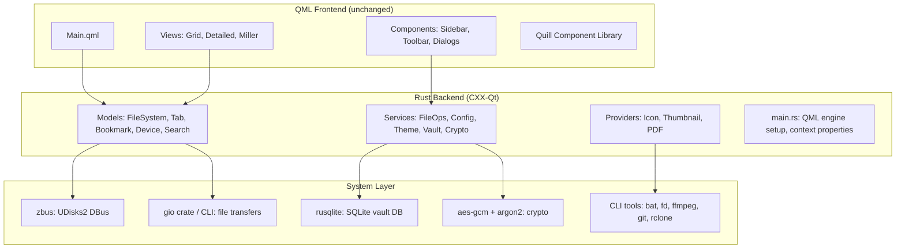

# Bubble: C++ to Rust Migration Plan

> Full backend rewrite using CXX-Qt, pure Cargo build system, binary release distribution

---

## Table of Contents

- [1. Scope Summary](#1-scope-summary)
- [2. Architecture Overview](#2-architecture-overview)
- [3. Crate Structure](#3-crate-structure)
- [4. Dependency Mapping](#4-dependency-mapping)
- [5. Migration Phases](#5-migration-phases)
- [6. Build System](#6-build-system)
- [7. Install Script](#7-install-script)
- [8. CI/CD Pipeline](#8-cicd-pipeline)
- [9. README Updates](#9-readme-updates)
- [10. Files to Remove](#10-files-to-remove)
- [11. Files to Create](#11-files-to-create)
- [12. Risk Assessment](#12-risk-assessment)

---

## 1. Scope Summary

| Decision | Choice |
|:---|:---|
| **Rewrite scope** | Full C++ backend -> Rust via CXX-Qt (all 40+ files) |
| **Migration strategy** | All at once, single merge |
| **Build system** | Pure Cargo + CXX-Qt (replace CMake entirely) |
| **Release artifacts** | AppImage + binary tarball (drop Flatpak) |
| **Distribution** | Precompiled binaries from GitHub Releases |
| **Install method** | Single `install.sh` with `--update` / `--uninstall` flags |
| **Install location** | `~/.local/bin` default, `--system` for `/usr/local/bin` |
| **Emojis** | None anywhere |
| **Version** | `0.1.0` in Cargo.toml |
| **Target arch** | x86_64 Linux only |
| **Quill submodule** | Keep, update for Cargo build |
| **Tests** | Port to Rust `#[test]` |
| **Packaging** | Drop PKGBUILD, Nix flake, Flatpak manifest |

---

## 2. Architecture Overview

The architecture stays as a three-layer Qt6 application. Only the middle layer changes language:



---

## 3. Crate Structure

The project will be organized as a Cargo workspace with multiple crates for clean separation:

```
Bubble/
├── Cargo.toml                    # Workspace root
├── Cargo.lock
├── rust-toolchain.toml
├── .cargo/
│   └── config.toml               # Build flags, linker settings
├── crates/
│   ├── bubble-core/              # Pure Rust business logic (no Qt)
│   │   ├── Cargo.toml
│   │   └── src/
│   │       ├── lib.rs
│   │       ├── config.rs          # TOML config parsing (serde + toml)
│   │       ├── theme.rs           # Theme TOML loading
│   │       ├── crypto.rs          # AES-256-GCM + Argon2id
│   │       ├── vault_db.rs        # SQLite vault database (rusqlite)
│   │       ├── xdg_trash.rs       # XDG trash spec implementation
│   │       ├── cloud_mounts.rs    # Cloud mount path helpers
│   │       ├── archive_password.rs
│   │       ├── git_status.rs      # Git status parsing
│   │       ├── metadata.rs        # Metadata extraction (CLI)
│   │       ├── search.rs          # fd-based search + fallback
│   │       ├── disk_usage.rs      # Recursive size with inode dedup
│   │       ├── icon_resolver.rs   # XDG icon theme resolution
│   │       ├── transfer.rs        # GIO transfer worker
│   │       └── runtime_features.rs
│   │
│   ├── bubble-qt/                # CXX-Qt bridge layer
│   │   ├── Cargo.toml
│   │   ├── build.rs              # CXX-Qt build script + QML module
│   │   └── src/
│   │       ├── lib.rs
│   │       ├── models/
│   │       │   ├── mod.rs
│   │       │   ├── filesystem_model.rs
│   │       │   ├── tab_model.rs
│   │       │   ├── tab_list_model.rs
│   │       │   ├── bookmark_model.rs
│   │       │   ├── device_model.rs
│   │       │   ├── recent_files_model.rs
│   │       │   ├── search_results_model.rs
│   │       │   └── search_proxy_model.rs
│   │       ├── services/
│   │       │   ├── mod.rs
│   │       │   ├── config_manager.rs
│   │       │   ├── theme_loader.rs
│   │       │   ├── file_operations.rs
│   │       │   ├── clipboard_manager.rs
│   │       │   ├── drag_helper.rs
│   │       │   ├── vault_service.rs
│   │       │   ├── search_service.rs
│   │       │   ├── preview_service.rs
│   │       │   ├── disk_usage_service.rs
│   │       │   ├── undo_manager.rs
│   │       │   ├── dependency_checker.rs
│   │       │   ├── runtime_features_service.rs
│   │       │   ├── remote_access_service.rs
│   │       │   ├── rclone_service.rs
│   │       │   ├── metadata_extractor.rs
│   │       │   ├── git_status_service.rs
│   │       │   └── session_state.rs
│   │       └── providers/
│   │           ├── mod.rs
│   │           ├── icon_provider.rs
│   │           ├── thumbnail_provider.rs
│   │           └── pdf_preview_provider.rs
│   │
│   ├── bubble-vault-destroy/     # Standalone binary
│   │   ├── Cargo.toml
│   │   └── src/
│   │       └── main.rs
│   │
│   └── bubble-vault-helper/      # Standalone binary (ioctl helper)
│       ├── Cargo.toml
│       └── src/
│           └── main.rs
│
├── src/
│   └── main.rs                   # Application entry point
├── src/qml/                      # QML frontend (unchanged)
├── themes/                       # TOML theme files (unchanged)
├── dist/                         # Desktop files, icons, metainfo
├── tests/                        # Integration tests (Rust)
├── install.sh                    # Unified install/update/uninstall
├── scripts/
│   └── prune-appdir.sh
├── .github/
│   └── workflows/
│       └── build.yml             # Updated CI
├── LICENSE
└── README.md
```

---

## 4. Dependency Mapping

### 4.1 C++ Library to Rust Crate Replacement

| C++ Dependency | Rust Replacement | Crate | Notes |
|:---|:---|:---|:---|
| Qt6 Object System | CXX-Qt | `cxx-qt`, `cxx-qt-lib` | `#[cxx_qt::bridge]` for Q_OBJECT, Q_PROPERTY, Q_INVOKABLE |
| `QAbstractListModel` | CXX-Qt model trait | `cxx-qt-lib` | Implement `rowCount`, `data`, `roleNames` via trait |
| `QSortFilterProxyModel` | CXX-Qt proxy model | `cxx-qt-lib` | Bridge `filterAcceptsRow` to Rust |
| `toml++` (C++ header) | `toml` + `serde` | `toml = "0.8"`, `serde = "1"` | Config and theme parsing |
| OpenSSL `libcrypto` | `aes-gcm` + `rand` | `aes-gcm = "0.10"`, `rand = "0.8"` | AES-256-GCM, pure Rust |
| `libargon2` | `argon2` | `argon2 = "0.5"` | Argon2id KDF, pure Rust |
| `Qt6::Sql` (SQLite) | `rusqlite` | `rusqlite = { version = "0.31", features = ["bundled"] }` | Bundled SQLite, no system dep |
| GIO `gio-2.0` | `gio` crate or CLI | `gio = "0.20"` | File transfers, volume monitor |
| GLib | `glib` crate | `glib = "0.20"` | Required by gio crate |
| UDisks2 DBus | `zbus` | `zbus = "4"` | Async DBus, pure Rust |
| `QThread` / `QtConcurrent` | `tokio` / `rayon` | `tokio = "1"`, `rayon = "1.10"` | Async tasks, parallel scanning |
| `sys/xattr.h` | `xattr` | `xattr = "1"` | Linux extended attributes |
| `linux/fs.h` ioctl | `nix` | `nix = { version = "0.29", features = ["ioctl"] }` | FS_IOC_SETFLAGS |
| `QFileSystemWatcher` | `notify` | `notify = "6"` | Filesystem change monitoring |
| `QProcess` (CLI spawn) | `std::process::Command` / `tokio::process` | stdlib / tokio | Spawning bat, fd, ffmpeg, git, etc. |
| `QLocalServer/Socket` | Unix domain sockets | `tokio::net::UnixListener` | Single-instance IPC |
| `QImage` / `QSvgRenderer` | CXX-Qt bridge | `cxx-qt-lib` | Image providers still need Qt types |
| `QJsonDocument` | `serde_json` | `serde_json = "1"` | Session state, IPC messages |

### 4.2 Cargo.toml Dependencies (workspace root)

```toml
[workspace]
resolver = "2"
members = [
    "crates/bubble-core",
    "crates/bubble-qt",
    "crates/bubble-vault-destroy",
    "crates/bubble-vault-helper",
]

[workspace.package]
version = "0.1.0"
edition = "2021"
license = "MIT"
authors = ["Soyeb Pervez Jim"]
repository = "https://github.com/TattvaOrg/Bubble"

[workspace.dependencies]
# Qt bindings
cxx = "1"
cxx-qt = "0.7"
cxx-qt-lib = "0.7"
cxx-qt-build = "0.7"

# Serialization
serde = { version = "1", features = ["derive"] }
serde_json = "1"
toml = "0.8"

# Crypto
aes-gcm = "0.10"
argon2 = "0.5"
rand = "0.8"

# Database
rusqlite = { version = "0.31", features = ["bundled"] }

# System
nix = { version = "0.29", features = ["ioctl", "fs", "signal", "process"] }
xattr = "1"
notify = "6"
zbus = "4"

# Async
tokio = { version = "1", features = ["full"] }
rayon = "1.10"

# GIO (optional, for transfer worker)
gio = "0.20"
glib = "0.20"

# Utilities
thiserror = "1"
anyhow = "1"
log = "0.4"
env_logger = "0.11"
dirs = "5"
walkdir = "2"
glob = "0.3"
regex = "1"
chrono = "0.4"
```

---

## 5. Migration Phases

### Phase 1: Pure Rust Business Logic (`bubble-core`)

Port all non-Qt logic into a standalone Rust crate with full unit tests. This crate has zero Qt dependency and can be tested independently.

| C++ Source | Rust Target | Rust Dependencies | Priority |
|:---|:---|:---|:---|
| `services/cryptoengine.cpp/.h` | `crypto.rs` | `aes-gcm`, `argon2`, `rand` | P0 |
| `services/vaultdatabase.cpp/.h` | `vault_db.rs` | `rusqlite` | P0 |
| `services/configmanager.cpp/.h` (parsing only) | `config.rs` | `toml`, `serde`, `dirs` | P0 |
| `services/themeloader.cpp/.h` (parsing only) | `theme.rs` | `toml`, `serde` | P0 |
| `services/xdgtrash.cpp/.h` | `xdg_trash.rs` | `walkdir`, `chrono` | P1 |
| `services/gitstatusservice.cpp/.h` (parsing) | `git_status.rs` | `std::process` | P1 |
| `services/diskusageservice.cpp/.h` (worker) | `disk_usage.rs` | `walkdir`, `nix` | P1 |
| `services/runtimefeaturesservice.cpp/.h` | `runtime_features.rs` | `std::process` | P2 |
| `services/metadataextractor.cpp/.h` (CLI) | `metadata.rs` | `std::process`, `serde_json` | P2 |
| `services/searchservice.cpp/.h` (worker) | `search.rs` | `walkdir`, `glob`, `regex` | P2 |
| `third_party/toml.hpp` | **Removed** (replaced by `toml` crate) | - | P0 |
| `cloudmounts.h` | `cloud_mounts.rs` | `dirs` | P2 |
| `archivepassword.h` | `archive_password.rs` | (constants only) | P2 |

> [!IMPORTANT]
> Every module in `bubble-core` must have comprehensive `#[cfg(test)]` unit tests that mirror the existing C++ Qt test coverage. The crypto module especially needs identical test vectors to ensure the Rust implementation can decrypt files encrypted by the old C++ version.

### Phase 2: CXX-Qt Bridge Layer (`bubble-qt`)

Wrap each backend component in a `#[cxx_qt::bridge]` module, exposing Q_PROPERTY, Q_INVOKABLE, and signals to QML.

#### 2a. Services (simpler, fewer model signals)

| C++ Class | Rust Bridge Module | Key Bridged API |
|:---|:---|:---|
| `ConfigManager` | `config_manager.rs` | 43 Q_PROPERTYs, `reload()`, `saveSettings()`, `shortcut()` |
| `ThemeLoader` | `theme_loader.rs` | 12 QColor properties, `themeChanged` signal |
| `ClipboardManager` | `clipboard_manager.rs` | `copy()`, `cut()`, `take()`, `wl-copy` spawn |
| `DragHelper` | `drag_helper.rs` | `startDrag()`, `active` property |
| `SessionState` | `session_state.rs` | 3 properties (grid columns, row heights) |
| `RuntimeFeaturesService` | `runtime_features_service.rs` | 6 CONSTANT properties |
| `DependencyChecker` | `dependency_checker.rs` | `refresh()`, `installCommandFor()` |
| `RemoteAccessService` | `remote_access_service.rs` | `buildUri()`, `connectToLocation()` |
| `RcloneService` | `rclone_service.rs` | `mountRemote()`, `unmountRemote()` |
| `MetadataExtractor` | `metadata_extractor.rs` | `extract()` |
| `GitStatusService` | `git_status_service.rs` | `setRootPath()`, `statusForPath()` |
| `SearchService` | `search_service.rs` | `startSearch()`, `cancelSearch()` |
| `PreviewService` | `preview_service.rs` | `requestPreview()`, text/dir/archive loaders |
| `DiskUsageService` | `disk_usage_service.rs` | `requestSize()`, `cancelRequest()` |
| `VaultService` | `vault_service.rs` | 17 Q_INVOKABLEs, locking/sessions |
| `UndoManager` | `undo_manager.rs` | `undo()`, `redo()`, undoable wrappers |
| `FileOperations` | `file_operations.rs` | 45 Q_INVOKABLEs, GIO transfer, archive ops |

#### 2b. Models (requires QAbstractListModel implementation)

| C++ Class | Rust Bridge Module | Roles Count | Complexity |
|:---|:---|:---|:---|
| `TabModel` | `tab_model.rs` | N/A (QObject) | Medium - navigation stacks |
| `TabListModel` | `tab_list_model.rs` | 3 roles | Medium - session serialize |
| `BookmarkModel` | `bookmark_model.rs` | 3 roles | Low |
| `RecentFilesModel` | `recent_files_model.rs` | 14 roles | Low |
| `SearchResultsModel` | `search_results_model.rs` | 14 roles | Low |
| `SearchProxyModel` | `search_proxy_model.rs` | N/A (proxy) | Medium - filter logic |
| `DeviceModel` | `device_model.rs` | 9 roles | High - GIO + DBus |
| `FileSystemModel` | `filesystem_model.rs` | 24 roles | **Very High** - 80K lines |

> [!WARNING]
> `FileSystemModel` is by far the most complex component. It has 24 data roles, async directory scanning via QtConcurrent with generation counters, integration with `GitStatusService` and `VaultService`, virtual roots for Trash and Remote mounts, and `QFileSystemWatcher` monitoring. This should be ported last within Phase 2.

#### 2c. Providers

| C++ Class | Rust Bridge Module | Notes |
|:---|:---|:---|
| `IconProvider` | `icon_provider.rs` | Subclass `QQuickImageProvider`, use `icon_resolver.rs` from core |
| `ThumbnailProvider` | `thumbnail_provider.rs` | Subclass `QQuickAsyncImageProvider`, spawn CLI tools |
| `PdfPreviewProvider` | `pdf_preview_provider.rs` | Subclass `QQuickAsyncImageProvider`, spawn pdftoppm |

### Phase 3: Application Entry Point

Port [main.cpp](file:///home/cachy/github-p/github-based/Bubble/src/main.cpp) to `src/main.rs`:

- Wayland detection and error messaging
- Single-instance IPC via Unix domain sockets (`tokio::net::UnixListener`)
- QML engine setup with import paths
- Image provider registration
- 29 context property registrations
- KWindowSystem blur integration (conditional compilation with `cfg` feature)
- `UiFontGuard` event filter
- CLI argument parsing (`--new-window`, `--help`, `--version`, path forwarding)

### Phase 4: Standalone Binaries

| C++ Source | Rust Target | Binary Name |
|:---|:---|:---|
| `vaultdestroy.cpp` | `crates/bubble-vault-destroy/src/main.rs` | `bubble-vault-destroy` |
| `vaulthelper.cpp` | `crates/bubble-vault-helper/src/main.rs` | `bubble-vault-helper` |

### Phase 5: Test Suite

Port all 28 test files to Rust:

| Test Category | C++ Tests | Rust Approach |
|:---|:---|:---|
| Pure logic (config, theme, crypto, vault DB, trash) | 6 tests | `#[test]` in `bubble-core` |
| Models (bookmark, tab, filesystem, search, device) | 8 tests | `#[test]` in `bubble-qt` with `QTest` helpers |
| Services (fileops, clipboard, undo, preview, search, rclone, remote, diskusage) | 8 tests | `#[test]` in `bubble-qt` |
| Providers (icon, thumbnail, pdf) | 3 tests | `#[test]` in `bubble-qt` |
| GIO worker | 1 test | `#[test]` in `bubble-qt` |
| QML integration (detailedview, millerview, contextmenu, toolbar, mainwindow) | 5 tests | QML test harness via CXX-Qt |
| CLI tests (help, version) | 2 tests | `#[test]` in root crate |
| Shell IPC test | 1 test | Keep as shell script |

---

## 6. Build System

### 6.1 Root Cargo.toml

The workspace root `Cargo.toml` is shown in section 4.2 above.

### 6.2 CXX-Qt Build Script (`crates/bubble-qt/build.rs`)

```rust
use cxx_qt_build::{CxxQtBuilder, QmlModule};

fn main() {
    CxxQtBuilder::new()
        .qt_module("Qt6::Core")
        .qt_module("Qt6::Gui")
        .qt_module("Qt6::Qml")
        .qt_module("Qt6::Quick")
        .qt_module("Qt6::QuickControls2")
        .qt_module("Qt6::DBus")
        .qt_module("Qt6::Svg")
        .qt_module("Qt6::Network")
        .qt_module("Qt6::Concurrent")
        .qml_module(QmlModule {
            uri: "Bubble",
            rust_files: &[
                "src/models/filesystem_model.rs",
                "src/models/tab_model.rs",
                "src/models/tab_list_model.rs",
                "src/models/bookmark_model.rs",
                "src/models/device_model.rs",
                "src/models/recent_files_model.rs",
                "src/models/search_results_model.rs",
                "src/models/search_proxy_model.rs",
                "src/services/config_manager.rs",
                "src/services/theme_loader.rs",
                "src/services/file_operations.rs",
                "src/services/clipboard_manager.rs",
                "src/services/drag_helper.rs",
                "src/services/vault_service.rs",
                "src/services/search_service.rs",
                "src/services/preview_service.rs",
                "src/services/disk_usage_service.rs",
                "src/services/undo_manager.rs",
                "src/services/dependency_checker.rs",
                "src/services/runtime_features_service.rs",
                "src/services/remote_access_service.rs",
                "src/services/rclone_service.rs",
                "src/services/metadata_extractor.rs",
                "src/services/git_status_service.rs",
                "src/services/session_state.rs",
                "src/providers/icon_provider.rs",
                "src/providers/thumbnail_provider.rs",
                "src/providers/pdf_preview_provider.rs",
            ],
            qml_files: &[
                // All QML files from src/qml/
                "../../src/qml/Main.qml",
                // ... (all 60+ QML files)
            ],
            ..Default::default()
        })
        .build();
}
```

### 6.3 Building

```bash
# Development build
cargo build

# Release build
cargo build --release

# Run tests
cargo test --workspace

# Install locally
cargo install --path .
```

---

## 7. Install Script

A single [install.sh](file:///home/cachy/github-p/github-based/Bubble/install.sh) replaces the current install.sh and update.sh. It downloads prebuilt binaries from GitHub Releases.

### 7.1 Usage

```bash
# Install
curl -sSL https://raw.githubusercontent.com/TattvaOrg/Bubble/main/install.sh | bash

# Update
curl -sSL https://raw.githubusercontent.com/TattvaOrg/Bubble/main/install.sh | bash -s -- --update

# Uninstall
curl -sSL https://raw.githubusercontent.com/TattvaOrg/Bubble/main/install.sh | bash -s -- --uninstall
```

### 7.2 Script Behavior

```
install.sh [options]

Modes:
  (default)     Install Bubble (download binary from latest release)
  --update      Update to latest version
  --uninstall   Remove Bubble and optionally shred vault data

Options:
  --system      Install to /usr/local (requires sudo)
  --prefix DIR  Install to custom directory
  -y, --yes     Skip confirmation prompts
  -h, --help    Show help
```

### 7.3 Script Logic

1. **Detect architecture** (`uname -m`, must be `x86_64`)
2. **Query GitHub API** for latest release: `https://api.github.com/repos/TattvaOrg/Bubble/releases/latest`
3. **Download tarball**: `Bubble-<tag>-x86_64-linux.tar.gz`
4. **Verify checksum** (SHA256 from release assets)
5. **Extract** to `~/.local/` (or specified prefix):
   - `bin/bubble`, `bin/bubble-vault-destroy`, `bin/bubble-vault-helper`
   - `share/bubble/themes/*.toml`
   - `share/bubble/src/qml/**`
6. **Install desktop file** to `~/.local/share/applications/`
7. **Install icon** to `~/.local/share/icons/hicolor/scalable/apps/`
8. **Update desktop database**

For `--update`: compare installed version (`bubble --version`) with latest release tag, skip if already current.

For `--uninstall`: remove installed files, optionally run `bubble-vault-destroy --all-users` for secure cleanup.

---

## 8. CI/CD Pipeline

### 8.1 Updated `.github/workflows/build.yml`

The workflow will be restructured for Rust:

```yaml
name: Build

on:
  push:
    branches: [main]
    tags: ['v*']
  pull_request:
    branches: [main]

permissions:
  contents: read

jobs:
  build:
    runs-on: ubuntu-24.04
    steps:
      - name: Checkout
        uses: actions/checkout@v4
        with:
          submodules: recursive

      - name: Install Rust toolchain
        uses: dtolnay/rust-toolchain@stable

      - name: Cache Cargo
        uses: actions/cache@v4
        with:
          path: |
            ~/.cargo/registry
            ~/.cargo/git
            target
          key: ${{ runner.os }}-cargo-${{ hashFiles('**/Cargo.lock') }}

      - name: Install Qt6
        uses: jurplel/install-qt-action@v4
        with:
          version: '6.7.3'
          modules: 'qtshadertools'

      - name: Install system dependencies
        run: |
          sudo apt-get update
          sudo apt-get install -y \
            cmake ninja-build \
            libgl-dev libxkbcommon-dev libdbus-1-dev \
            libwayland-dev libegl-dev libgles-dev libvulkan-dev \
            wayland-protocols xdg-utils file libfuse2 \
            libglib2.0-dev libgio2.0-cil-dev \
            gvfs dbus p7zip-full

      - name: Build
        run: cargo build --release --workspace

      - name: Run tests
        env:
          QT_QPA_PLATFORM: offscreen
        run: |
          dbus-run-session -- cargo test --workspace

      # Tag-only: create release artifacts
      - name: Create binary tarball
        if: startsWith(github.ref, 'refs/tags/v')
        run: |
          scripts/create-tarball.sh

      - name: Build AppImage
        if: startsWith(github.ref, 'refs/tags/v')
        run: |
          scripts/create-appimage.sh

      - name: Upload tarball artifact
        if: startsWith(github.ref, 'refs/tags/v')
        uses: actions/upload-artifact@v4
        with:
          name: bubble-tarball
          path: Bubble-${{ github.ref_name }}-x86_64-linux.tar.gz

      - name: Upload AppImage artifact
        if: startsWith(github.ref, 'refs/tags/v')
        uses: actions/upload-artifact@v4
        with:
          name: bubble-appimage
          path: Bubble-${{ github.ref_name }}-x86_64.AppImage

  release:
    if: startsWith(github.ref, 'refs/tags/v')
    needs: build
    runs-on: ubuntu-24.04
    permissions:
      contents: write

    steps:
      - name: Checkout
        uses: actions/checkout@v4

      - name: Download artifacts
        uses: actions/download-artifact@v4

      - name: Generate checksums
        run: |
          sha256sum bubble-tarball/*.tar.gz bubble-appimage/*.AppImage > checksums-sha256.txt

      - name: Release notes from tag message
        run: |
          git fetch --force --no-tags origin "refs/tags/${GITHUB_REF_NAME}:refs/tags/${GITHUB_REF_NAME}"
          git tag -l --format='%(contents)' "${GITHUB_REF_NAME}" > release-notes.md
          test -s release-notes.md

      - name: Create GitHub Release
        uses: softprops/action-gh-release@v2
        with:
          files: |
            bubble-tarball/Bubble-${{ github.ref_name }}-x86_64-linux.tar.gz
            bubble-appimage/Bubble-${{ github.ref_name }}-x86_64.AppImage
            checksums-sha256.txt
          body_path: release-notes.md
```

### 8.2 Helper Scripts

**`scripts/create-tarball.sh`**: Packages the release binary + themes + QML + desktop files into a tarball.

**`scripts/create-appimage.sh`**: Uses linuxdeploy to create an AppImage from the Cargo release binary.

---

## 9. README Updates

The README will be updated to reflect:

1. **Architecture section**: "Rust backend" instead of "C++ backend"
2. **Installation section**: New one-liner commands for binary install
3. **Build from source**: `cargo build --release` instead of CMake
4. **Dependencies**: Rust toolchain + Qt6 dev libraries
5. **Remove**: References to CMake, PKGBUILD, Nix flake, Flatpak
6. **Contributing section**: Updated build instructions, `cargo test`

### Key README Changes

```markdown
## Installation

### One-Liner Install

```bash
curl -sSL https://raw.githubusercontent.com/TattvaOrg/Bubble/main/install.sh | bash
```

### Update

```bash
curl -sSL https://raw.githubusercontent.com/TattvaOrg/Bubble/main/install.sh | bash -s -- --update
```

### Uninstall

```bash
curl -sSL https://raw.githubusercontent.com/TattvaOrg/Bubble/main/install.sh | bash -s -- --uninstall
```

### Build from Source

```bash
git clone --recursive https://github.com/TattvaOrg/Bubble.git
cd Bubble
cargo build --release
cargo install --path .
```
```

---

## 10. Files to Remove

| File/Directory | Reason |
|:---|:---|
| `CMakeLists.txt` (root) | Replaced by Cargo workspace |
| `src/CMakeLists.txt` | Replaced by Cargo workspace |
| `src/main.cpp` | Replaced by `src/main.rs` |
| `src/models/*.cpp` `src/models/*.h` | Replaced by Rust modules |
| `src/services/*.cpp` `src/services/*.h` | Replaced by Rust modules |
| `src/providers/*.cpp` `src/providers/*.h` | Replaced by Rust modules |
| `src/vaultdestroy.cpp` | Replaced by `crates/bubble-vault-destroy/` |
| `src/vaulthelper.cpp` | Replaced by `crates/bubble-vault-helper/` |
| `src/third_party/toml.hpp` | Replaced by `toml` crate |
| `PKGBUILD` | Dropped per decision |
| `.SRCINFO` | Dropped (PKGBUILD metadata) |
| `flake.nix` | Dropped per decision |
| `flake.lock` | Dropped per decision |
| `io.github.soyeb_jim285.Bubble.yml` | Dropped (Flatpak manifest) |
| `io.github.soyeb_jim285.HyprFM.yml` | Dropped (duplicate Flatpak) |
| `update.sh` | Merged into `install.sh --update` |
| `hyprfm.desktop` | Legacy name, use `bubble.desktop` only |
| `tests/*.cpp` | Replaced by Rust tests |
| `.github/workflows/aur.yml` | Dropped (no more PKGBUILD) |

---

## 11. Files to Create

| File | Purpose |
|:---|:---|
| `Cargo.toml` | Workspace root |
| `Cargo.lock` | Dependency lockfile (auto-generated) |
| `rust-toolchain.toml` | Pin Rust edition/version |
| `.cargo/config.toml` | Build configuration |
| `src/main.rs` | Application entry point |
| `crates/bubble-core/Cargo.toml` | Core crate manifest |
| `crates/bubble-core/src/lib.rs` | Core crate root |
| `crates/bubble-core/src/*.rs` | ~14 pure Rust modules |
| `crates/bubble-qt/Cargo.toml` | Qt bridge crate manifest |
| `crates/bubble-qt/build.rs` | CXX-Qt build script |
| `crates/bubble-qt/src/lib.rs` | Qt bridge crate root |
| `crates/bubble-qt/src/models/*.rs` | 8 model bridge modules |
| `crates/bubble-qt/src/services/*.rs` | 17 service bridge modules |
| `crates/bubble-qt/src/providers/*.rs` | 3 provider bridge modules |
| `crates/bubble-vault-destroy/Cargo.toml` | Vault destroy crate |
| `crates/bubble-vault-destroy/src/main.rs` | Vault destroy entry point |
| `crates/bubble-vault-helper/Cargo.toml` | Vault helper crate |
| `crates/bubble-vault-helper/src/main.rs` | ioctl helper entry point |
| `install.sh` (rewritten) | Unified install/update/uninstall |
| `scripts/create-tarball.sh` | Release tarball builder |
| `scripts/create-appimage.sh` | AppImage builder |
| `.github/workflows/build.yml` (rewritten) | Updated CI pipeline |

---

## 12. Risk Assessment

### High Risk

| Risk | Impact | Mitigation |
|:---|:---|:---|
| CXX-Qt `QAbstractListModel` support maturity | May need custom C++ shim code for complex model operations (beginInsertRows, etc.) | Prototype `BookmarkModel` first as proof-of-concept; fall back to thin C++ wrapper if needed |
| `QQuickImageProvider` subclassing from Rust | CXX-Qt may not support this directly | May need a small C++ shim that delegates to Rust via CXX bridge |
| GIO C library integration from Rust | `gio` Rust crate ties to specific glib-rs versions | Consider keeping `GioTransferWorker` as a thin C++ file bridged via CXX if the Rust crate is problematic |
| Vault backward compatibility | Existing encrypted files must be decryptable by the new Rust crypto | Use identical Argon2id parameters and AES-256-GCM nonce/tag sizes; add cross-version decrypt tests |

### Medium Risk

| Risk | Impact | Mitigation |
|:---|:---|:---|
| Build times | CXX-Qt + Cargo + Qt6 compilation is slow | Use `sccache`, Cargo workspace caching, incremental builds |
| QML module registration | CXX-Qt QML module may behave differently than CMake qt6_add_qml_module | Test QML type resolution early in Phase 2 |
| KWindowSystem optional dependency | Feature-gated blur effects | Use Cargo `[features]` with `cfg` attributes |

### Low Risk

| Risk | Impact | Mitigation |
|:---|:---|:---|
| TOML config compatibility | Config format stays the same | Same TOML spec, `serde` handles it |
| SQLite vault DB compatibility | DB schema stays the same | `rusqlite` reads same SQLite files |
| CLI tool spawning | Same external tools (bat, fd, etc.) | `std::process::Command` is straightforward |

> [!CAUTION]
> This is a **massive** rewrite touching every backend file. The QML frontend should remain unchanged, but any mismatch in property names, signal signatures, or role enums between the old C++ and new Rust bridge will break the UI silently. A systematic approach of porting one module at a time and running QML integration tests after each is essential.

---

> [!NOTE]
> **Next Steps**: Once this plan is approved, implementation will proceed file-by-file starting with `bubble-core` (pure Rust, no Qt dependency), then the CXX-Qt bridge modules, and finally the entry point and CI pipeline. Each phase will be a separate set of file creations.
